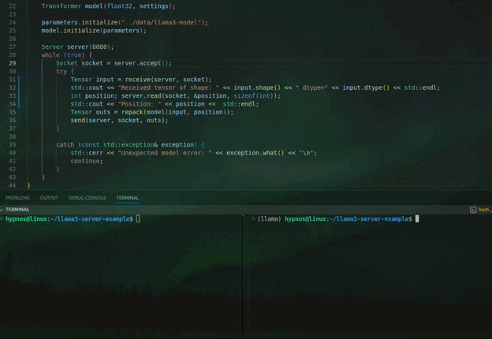

# Example of text completion with Meta LLaMA 3
 


⚠️🚨☢️  DANGER ☢️ 🚨⚠️  

META'S LLAMA 3 HAVE A RESTRICTIVE LICENSE ⚠️.  

IF YOU USE OR REDISTRIBUTE LLAMA 3 WITHOUT READING AND UNDERSTANDING THE LICENSE,  
YOU MAY BE IN VIOLATION OF META'S LEGAL TERMS. ☠️☠️☠️  

💀 DO NOT USE LLAMA 3 UNLESS YOU HAVE:  
  1. READ THE LICENSE IN FULL  
  2. UNDERSTOOD EVERY CONDITION  
  3. ACCEPTED THE LEGAL RISKS  

READ THE LICENSE FIRST:  
👉 https://llama.meta.com/llama-downloads

🚫 IF YOU IGNORE THIS WARNING, YOU ARE ON YOUR OWN. 🚫  

IF YOU ARE LIKE ME AND YOU ARE NOT SURE ABOUT WHAT YOU ARE DOING ,  
JUST COPY AND PASTE THE LICENSE EVERYWHERE AND NAME EVERYTHING
LLAMA3.

## Important Technical Note
Meta’s original Llama 3 model is tightly bound to the CUDA (NVIDIA) vendor.
If you don’t have an NVIDIA GPU, you may not be able to run the official Python example.

This CUDA dependency is not a requirement of my library — it only comes from Meta’s reference implementation. Unfortunately, I cannot redistribute the Llama weights in my own .tannic format due to the license restrictions. That’s why you must first download Meta’s original files and migrate them yourself.


## 🛠 Setup and Run Llama 3 with C++ Server

### 1. Test Python Example First

Before attempting to run the C++ server, first verify that the Python text completion example works with the official Llama 3 weights. 

From the official Llama 3 website, download the 1B parameter model.
Place the following files in the data/ directory of your project:

* checklist.chk

* consolidated.00.pth

* params.json

* tokenizer.model 


### 2. Install Dependencies For Original Meta's Repository.

Original Meta's llama have a lot of external dependencies, make sure you have all dependencies installed, I removed fairscale so it will be easier for you to try 1B on a single GPU, however you still will need to manually install:

* rust (for the tiktoken tokenizer)

* tikToken

* torch

* fire


### 3. Run the Python Example

Run the example script with the downloaded model. Sadly the meta's original llama3 model is tightly bound to the CUDA (NVIDIA), if you don't have an NVIDIA card you may not be able to run the example. If you have an NVIDIA card run the example with:

```
python llama3_main.py     --ckpt_dir data     --tokenizer_path data/tokenizer.model     --temperature 0.6     --top_p 0.9     --sequence_length_limit 512
```

### 4. Migrate the weights 

Migrate the weights to the .tannic format. The .tannic format is a file format I designed that stores the raw weights in one file and the metadata in another. This allows the data and metadata to vary independently, so the weights are not tied to this specific library. Anyone can create their own file format and interpret the weights however they want. To migrate first install the python bindings:

```bash 
pip install pytannic
```

Then run the migrate.py script. 

### 5. Finally compile and run the C++ server.

The compile and run the server:

```
mkdir -p build
cd build
cmake ..
make -j$(nproc)
./llama3-server
```

This will setup a C++ server with the Transformer module that llama uses, you can talk to it with with python client with:

```
python main.py     --ckpt_dir data     --tokenizer_path data/tokenizer.model     --temperature 0.6     --top_p 0.9     --sequence_length_limit 512
```

There are a few issues I have to solve to run the model on device, but this will be supported soon so stay tune.